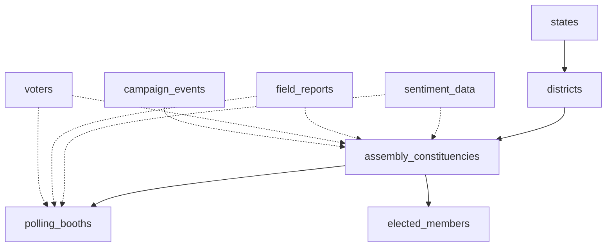

# Master Data Architecture for Pulse of People
## Geographic Hierarchy & Organization Structure

**Date**: 2025-11-06
**Version**: 1.0

---

## Table of Contents
1. [Overview](#overview)
2. [Geographic Hierarchy](#geographic-hierarchy)
3. [Database Structure](#database-structure)
4. [File Organization](#file-organization)
5. [Data Flow Architecture](#data-flow-architecture)
6. [API Structure](#api-structure)
7. [UI Component Structure](#ui-component-structure)
8. [Implementation Roadmap](#implementation-roadmap)

---

## Overview

The Pulse of People platform is built around a **4-level geographic hierarchy** for Tamil Nadu and Pondicherry:

```
1. State Level (2 states)
   ├── Tamil Nadu (TN)
   └── Pondicherry (PY)
       │
       ├─> 2. District Level (38 districts in TN, 4 in PY)
       │       │
       │       ├─> 3. Assembly Constituency Level (234 in TN, 30 in PY)
       │       │       │
       │       │       └─> 4. Polling Booth Level (~70,000+ booths)
```

This hierarchical structure enables:
- **Drill-down Analysis**: From state → district → constituency → booth
- **Roll-up Aggregation**: From booth → constituency → district → state
- **Sentiment Tracking**: At every geographic level
- **Campaign Management**: Targeted by geographic boundaries
- **User Hierarchy**: Role-based access mapped to geography

---

## Geographic Hierarchy

### 1. State Level

**Purpose**: Top-level container for all data

**Master Data Location**:
- **Database**: `states` table
- **File**: `/src/data/masters/states.ts`
- **TypeScript**: `/src/types/geography.ts` (State interface)

**Data Structure**:
```typescript
interface State {
  code: string;              // 'TN', 'PY'
  name: string;              // 'Tamil Nadu'
  districts: string[];       // Array of district codes
  totalConstituencies: number;
  totalVoters: number;
  center: Coordinates;
  sentiment?: SentimentScore;
}
```

**Database Table**:
```sql
CREATE TABLE states (
  code TEXT PRIMARY KEY,      -- 'TN', 'PY'
  name TEXT NOT NULL,
  name_local TEXT,            -- Tamil name
  total_districts INTEGER,
  total_constituencies INTEGER,
  total_voters BIGINT,
  area_km2 DECIMAL(10,2),
  center_lat DECIMAL(10,8),
  center_lng DECIMAL(11,8),
  center_point GEOGRAPHY(POINT, 4326),
  geojson JSONB,              -- State boundary polygon
  tenant_id TEXT,
  created_at TIMESTAMPTZ DEFAULT NOW(),
  updated_at TIMESTAMPTZ DEFAULT NOW()
);
```

---

### 2. District Level

**Purpose**: Administrative division for organizing constituencies

**Master Data Location**:
- **Database**: `districts` table
- **File**: `/src/data/masters/districts.ts`
- **TypeScript**: `/src/types/geography.ts` (District interface)

**Data Structure**:
```typescript
interface District {
  code: string;              // 'TN01' (Ariyalur)
  name: string;
  stateCode: string;
  center: Coordinates;
  constituencies: string[];   // Array of constituency codes
  totalVoters: number;
  area: number;              // in sq km
  sentiment?: SentimentScore;
}
```

**Database Table**:
```sql
CREATE TABLE districts (
  id UUID PRIMARY KEY DEFAULT uuid_generate_v4(),
  code TEXT UNIQUE NOT NULL,       -- 'TN01', 'TN02', 'PY01'
  name TEXT NOT NULL,
  name_tamil TEXT,
  state_code TEXT NOT NULL REFERENCES states(code),

  -- Geographic data
  center_lat DECIMAL(10,8),
  center_lng DECIMAL(11,8),
  center_point GEOGRAPHY(POINT, 4326),
  area_km2 DECIMAL(10,2),
  geojson JSONB,                   -- District boundary polygon

  -- Electoral data
  total_constituencies INTEGER DEFAULT 0,
  total_voters BIGINT DEFAULT 0,
  total_polling_booths INTEGER DEFAULT 0,

  -- Metadata
  headquarters TEXT,
  formation_year INTEGER,

  -- Multi-tenancy
  tenant_id TEXT,

  created_at TIMESTAMPTZ DEFAULT NOW(),
  updated_at TIMESTAMPTZ DEFAULT NOW()
);

CREATE INDEX idx_districts_state ON districts(state_code);
CREATE INDEX idx_districts_code ON districts(code);
```

**Tamil Nadu Districts** (38):
- Ariyalur (TN01), Chengalpattu (TN02), Chennai (TN03), Coimbatore (TN04)
- Cuddalore (TN05), Dharmapuri (TN06), Dindigul (TN07), Erode (TN08)
- Kallakurichi (TN09), Kanchipuram (TN10), Kanyakumari (TN11), Karur (TN12)
- ... (see /src/types/geography.ts for complete enum)

**Pondicherry Districts** (4):
- Puducherry (PY01), Karaikal (PY02), Mahe (PY03), Yanam (PY04)

---

### 3. Assembly Constituency Level

**Purpose**: Electoral unit for Legislative Assembly elections

**Master Data Location**:
- **Database**: `assembly_constituencies` table (✅ Created)
- **File**: `/src/data/masters/constituencies.ts`
- **TypeScript**: `/src/types/geography.ts` (AssemblyConstituency interface) (✅ Updated)

**Data Structure**: Already defined in geography.ts with:
- Constituency code, number, name
- Reservation type (12 categories)
- District mapping
- Current elected member
- Election history
- Voter statistics

**Database Table**: ✅ Created in migration `20251106_create_constituency_master.sql`

**Reservation Categories**:
1. Unreserved (General)
2. Scheduled Castes (SC)
3. Scheduled Tribes (ST)
4. Women *
5. Muslims *
6. Christians *
7. Landholders *
8. Commerce and Industry *
9. Labour and Trade Unions *
10. Europeans *
11. Anglo-Indians *
12. University *

_* Historical categories, not currently used in Tamil Nadu_

---

### 4. Polling Booth Level

**Purpose**: Ground-level voting location

**Master Data Location**:
- **Database**: `polling_booths` table (✅ Created)
- **File**: `/src/data/masters/polling-booths/` (organized by constituency)
- **TypeScript**: `/src/types/geography.ts` (PollingBooth interface)

**Data Structure**: Already defined in geography.ts

**Database Table**: ✅ Created in migration `20251106_create_constituency_master.sql`

**Organization**:
```
/src/data/masters/polling-booths/
  ├── TN/
  │   ├── TN001_gummidipoondi.json
  │   ├── TN002_ponneri.json
  │   └── ... (234 files for TN)
  └── PY/
      ├── PY01_yanam.json
      ├── PY02_mahe.json
      └── ... (30 files for PY)
```

Each file contains array of booths for that constituency:
```json
[
  {
    "id": "uuid",
    "boothNumber": "001",
    "name": "Government Primary School, North Street",
    "constituencyCode": "TN001",
    "location": {"lat": 13.4074, "lng": 80.1119},
    "totalVoters": 1200,
    "maleVoters": 600,
    "femaleVoters": 600,
    "address": "North Street, Gummidipoondi",
    "isAccessible": true,
    "facilities": ["Ramp", "Wheelchair"]
  }
]
```

---

## Database Structure

### Complete Schema Organization

```
📦 Database (Supabase PostgreSQL)
├── 🏛️ MASTER DATA TABLES (Reference data)
│   ├── states                           (2 records)
│   ├── districts                        (42 records: 38 TN + 4 PY)
│   ├── assembly_constituencies          (264 records: 234 TN + 30 PY) ✅
│   ├── elected_members                  (Historical & current) ✅
│   └── polling_booths                   (~70,000 records) ✅
│
├── 👥 USER & TENANT MANAGEMENT
│   ├── users
│   ├── tenants
│   ├── organizations
│   ├── user_roles
│   └── permissions
│
├── 📊 SENTIMENT & ANALYTICS
│   ├── sentiment_data
│   ├── social_posts
│   ├── field_reports
│   ├── surveys
│   ├── survey_responses
│   └── trending_topics
│
├── 👤 INFLUENCERS & MEDIA
│   ├── influencers
│   ├── media_coverage
│   └── competitor_activity
│
├── 🎯 CAMPAIGNS & EVENTS
│   ├── campaigns
│   ├── campaign_events
│   ├── conversations
│   └── recommendations
│
├── 🗳️ VOTER DATA (DPDP Compliant)
│   ├── voters (anonymized)
│   └── volunteers
│
└── 🔍 AUDIT & SYSTEM
    ├── audit_log
    ├── alerts
    └── system_settings
```

### Relationships



---

## File Organization

### Recommended Project Structure

```
/Users/murali/1backup/pulseofpeople6nov/voter/
│
├── 📂 supabase/
│   ├── migrations/
│   │   ├── 20251027_create_all_tables.sql
│   │   ├── 20251028_add_rbac_system.sql
│   │   ├── 20251029_single_db_multi_tenant.sql
│   │   └── 20251106_create_constituency_master.sql ✅
│   │
│   └── seeds/
│       ├── 01_constituency_seed_template.sql ✅
│       ├── 02_states_seed.sql (TODO)
│       ├── 03_districts_seed.sql (TODO)
│       └── 04_polling_booths_seed.sql (TODO)
│
├── 📂 src/
│   │
│   ├── 📂 types/
│   │   ├── index.ts
│   │   ├── geography.ts ✅ (Updated with ReservationType enum)
│   │   ├── user.ts
│   │   ├── sentiment.ts
│   │   └── campaign.ts
│   │
│   ├── 📂 data/
│   │   ├── masters/
│   │   │   ├── states.ts (TODO)
│   │   │   ├── districts.ts (TODO)
│   │   │   ├── constituencies.ts (TODO)
│   │   │   └── polling-booths/
│   │   │       ├── TN/ (TODO)
│   │   │       └── PY/ (TODO)
│   │   │
│   │   └── geojson/
│   │       ├── states/
│   │       │   ├── TN.geojson (TODO)
│   │       │   └── PY.geojson (TODO)
│   │       ├── districts/
│   │       │   ├── TN01_ariyalur.geojson (TODO)
│   │       │   └── ... (42 files)
│   │       └── constituencies/
│   │           ├── TN001_gummidipoondi.geojson (TODO)
│   │           └── ... (264 files)
│   │
│   ├── 📂 services/
│   │   ├── api/
│   │   │   ├── stateService.ts (TODO)
│   │   │   ├── districtService.ts (TODO)
│   │   │   ├── constituencyService.ts (TODO)
│   │   │   └── pollingBoothService.ts (TODO)
│   │   │
│   │   ├── geography/
│   │   │   ├── hierarchyService.ts (TODO)
│   │   │   ├── boundaryService.ts (TODO)
│   │   │   └── drillDownService.ts (TODO)
│   │   │
│   │   └── supabase/
│   │       ├── client.ts
│   │       └── queries/
│   │           ├── constituencyQueries.ts (TODO)
│   │           └── geographyQueries.ts (TODO)
│   │
│   ├── 📂 components/
│   │   ├── maps/
│   │   │   ├── StateMap.tsx (TODO)
│   │   │   ├── DistrictMap.tsx (TODO)
│   │   │   ├── ConstituencyMap.tsx (TODO)
│   │   │   ├── PollingBoothMap.tsx (TODO)
│   │   │   └── DrillDownMap.tsx (TODO - Main component)
│   │   │
│   │   ├── geography/
│   │   │   ├── StateSelector.tsx (TODO)
│   │   │   ├── DistrictSelector.tsx (TODO)
│   │   │   ├── ConstituencySelector.tsx (TODO)
│   │   │   ├── GeoBreadcrumb.tsx (TODO)
│   │   │   └── GeographicFilters.tsx (TODO)
│   │   │
│   │   └── dashboard/
│   │       ├── StateDashboard.tsx (TODO)
│   │       ├── DistrictDashboard.tsx (TODO)
│   │       ├── ConstituencyDashboard.tsx (TODO)
│   │       └── BoothDashboard.tsx (TODO)
│   │
│   ├── 📂 hooks/
│   │   ├── useGeography.ts (TODO)
│   │   ├── useDrillDown.ts (TODO)
│   │   ├── useConstituencies.ts (TODO)
│   │   └── usePollingBooths.ts (TODO)
│   │
│   ├── 📂 contexts/
│   │   ├── GeographyContext.tsx (TODO)
│   │   └── DrillDownContext.tsx (TODO)
│   │
│   └── 📂 utils/
│       ├── geography/
│       │   ├── hierarchyUtils.ts (TODO)
│       │   ├── boundaryUtils.ts (TODO)
│       │   └── geoCalculations.ts (TODO)
│       └── map/
│           ├── mapUtils.ts (TODO)
│           └── choroplethUtils.ts (TODO)
│
└── 📂 docs/
    ├── MASTER_DATA_ARCHITECTURE.md ✅ (This file)
    ├── API_DOCUMENTATION.md (TODO)
    └── DATA_IMPORT_GUIDE.md (TODO)
```

---

## Data Flow Architecture

### 1. Data Loading Flow

```
Data Source (EC of India)
    ↓
CSV/Excel Files
    ↓
Data Cleaning Script (Python/Node)
    ↓
SQL Seed Files
    ↓
Supabase Database
    ↓
API Services (TypeScript)
    ↓
React Components
    ↓
User Interface
```

### 2. Drill-Down Flow

```
State Map (Click TN)
    ↓ (Load districts)
District Map (Click Chennai - TN03)
    ↓ (Load constituencies)
Constituency Map (Click Tiruvottiyur - TN003)
    ↓ (Load polling booths)
Polling Booth Map (Show individual booths)
    ↓ (Show booth details)
Booth Details Panel
```

### 3. Sentiment Aggregation Flow

```
Individual Booth Sentiment
    ↓ (Aggregate)
Constituency Sentiment
    ↓ (Aggregate)
District Sentiment
    ↓ (Aggregate)
State Sentiment
    ↓ (Display on Dashboard)
```

---

## API Structure

### Recommended API Endpoints

```typescript
// State APIs
GET  /api/geography/states
GET  /api/geography/states/:code
GET  /api/geography/states/:code/sentiment

// District APIs
GET  /api/geography/districts
GET  /api/geography/districts/:code
GET  /api/geography/districts/:code/constituencies
GET  /api/geography/districts/:code/sentiment

// Constituency APIs
GET  /api/geography/constituencies
GET  /api/geography/constituencies/:code
GET  /api/geography/constituencies/:code/booths
GET  /api/geography/constituencies/:code/election-history
GET  /api/geography/constituencies/:code/current-member
GET  /api/geography/constituencies/:code/sentiment

// Polling Booth APIs
GET  /api/geography/booths
GET  /api/geography/booths/:id
GET  /api/geography/booths/nearby?lat=x&lng=y&radius=5000
GET  /api/geography/booths/:id/sentiment

// Hierarchy APIs
GET  /api/geography/hierarchy/full
GET  /api/geography/hierarchy/drilldown?state=TN&district=TN03
GET  /api/geography/boundary/:type/:code  // Returns GeoJSON

// Search APIs
GET  /api/geography/search?q=madurai
GET  /api/geography/search/constituency?district=TN03
```

### Example Service Implementation

```typescript
// src/services/api/constituencyService.ts
import { supabase } from '@/services/supabase/client';
import { AssemblyConstituency } from '@/types/geography';

export class ConstituencyService {
  async getAll(stateCode?: string): Promise<AssemblyConstituency[]> {
    let query = supabase
      .from('assembly_constituencies')
      .select('*')
      .order('constituency_number');

    if (stateCode) {
      query = query.eq('state_code', stateCode);
    }

    const { data, error } = await query;
    if (error) throw error;
    return data;
  }

  async getByCode(code: string): Promise<AssemblyConstituency> {
    const { data, error } = await supabase
      .from('assembly_constituencies')
      .select(`
        *,
        current_member:elected_members!inner(*)
      `)
      .eq('code', code)
      .eq('elected_members.is_current_member', true)
      .single();

    if (error) throw error;
    return data;
  }

  async getByDistrict(districtCode: string): Promise<AssemblyConstituency[]> {
    const { data, error } = await supabase
      .from('assembly_constituencies')
      .select('*')
      .eq('district_code', districtCode)
      .order('constituency_number');

    if (error) throw error;
    return data;
  }

  async getElectionHistory(code: string) {
    const { data, error } = await supabase
      .from('elected_members')
      .select('*')
      .eq('constituency_code', code)
      .order('election_year', { ascending: false });

    if (error) throw error;
    return data;
  }
}

export const constituencyService = new ConstituencyService();
```

---

## UI Component Structure

### Main Map Component (Drill-Down)

```typescript
// src/components/maps/DrillDownMap.tsx
import React, { useState } from 'react';
import { MapContainer, TileLayer, GeoJSON } from 'react-leaflet';
import { MapViewState, MapDrillDownLevel } from '@/types/geography';

export function DrillDownMap() {
  const [viewState, setViewState] = useState<MapViewState>({
    center: { lat: 11.1271, lng: 78.6569 }, // TN center
    zoom: 7,
    drillDown: { level: 'state' }
  });

  const handleStateClick = (stateCode: string) => {
    // Load districts for this state
    setViewState({
      center: getStateCenter(stateCode),
      zoom: 8,
      drillDown: { level: 'district', selectedStateCode: stateCode }
    });
  };

  const handleDistrictClick = (districtCode: string) => {
    // Load constituencies for this district
    setViewState({
      ...viewState,
      zoom: 10,
      drillDown: {
        level: 'constituency',
        selectedStateCode: viewState.drillDown.selectedStateCode,
        selectedDistrictCode: districtCode
      }
    });
  };

  const handleConstituencyClick = (constituencyCode: string) => {
    // Load polling booths for this constituency
    setViewState({
      ...viewState,
      zoom: 12,
      drillDown: {
        ...viewState.drillDown,
        level: 'booth',
        selectedConstituencyCode: constituencyCode
      }
    });
  };

  return (
    <div className="h-full w-full">
      <GeoBreadcrumb viewState={viewState} onNavigate={setViewState} />

      <MapContainer center={viewState.center} zoom={viewState.zoom}>
        <TileLayer url="https://{s}.tile.openstreetmap.org/{z}/{x}/{y}.png" />

        {viewState.drillDown.level === 'state' && (
          <StateLayer onClick={handleStateClick} />
        )}

        {viewState.drillDown.level === 'district' && (
          <DistrictLayer
            stateCode={viewState.drillDown.selectedStateCode!}
            onClick={handleDistrictClick}
          />
        )}

        {viewState.drillDown.level === 'constituency' && (
          <ConstituencyLayer
            districtCode={viewState.drillDown.selectedDistrictCode!}
            onClick={handleConstituencyClick}
          />
        )}

        {viewState.drillDown.level === 'booth' && (
          <PollingBoothLayer
            constituencyCode={viewState.drillDown.selectedConstituencyCode!}
          />
        )}
      </MapContainer>

      <SentimentPanel viewState={viewState} />
    </div>
  );
}
```

---

## Implementation Roadmap

### Phase 1: Master Data Setup (Week 1) ✅ IN PROGRESS

**Tasks**:
1. ✅ Create TypeScript types for geography hierarchy
2. ✅ Create database migrations for:
   - ✅ assembly_constituencies table
   - ✅ elected_members table
   - ✅ polling_booths table
3. ⏳ Create remaining migrations:
   - states table
   - districts table
4. ⏳ Create seed data templates
5. ⏳ Import actual data from Election Commission sources

**Deliverables**:
- Complete database schema
- Seed SQL files
- TypeScript type definitions

---

### Phase 2: API Services (Week 2)

**Tasks**:
1. Implement service classes:
   - StateService
   - DistrictService
   - ConstituencyService
   - PollingBoothService
2. Create geography hierarchy service
3. Implement boundary/GeoJSON service
4. Create drill-down service
5. Write API endpoint handlers

**Deliverables**:
- Complete API service layer
- API documentation
- Unit tests for services

---

### Phase 3: UI Components (Week 3)

**Tasks**:
1. Create selector components:
   - StateSelector
   - DistrictSelector
   - ConstituencySelector
2. Create map components:
   - StateMap
   - DistrictMap
   - ConstituencyMap
   - PollingBoothMap
   - DrillDownMap (main component)
3. Create dashboard components for each level
4. Create geographic filters
5. Create breadcrumb navigation

**Deliverables**:
- Complete UI component library
- Storybook stories
- Component documentation

---

### Phase 4: Integration & Testing (Week 4)

**Tasks**:
1. Integrate all components
2. Implement drill-down functionality
3. Add sentiment visualization
4. Performance optimization
5. End-to-end testing
6. User acceptance testing

**Deliverables**:
- Fully functional drill-down system
- Performance benchmarks
- Test coverage report

---

### Phase 5: Data Import & Validation (Week 5)

**Tasks**:
1. Source official data from Election Commission
2. Clean and validate data
3. Import all 264 constituencies
4. Import ~70,000 polling booths
5. Import GeoJSON boundaries
6. Verify data accuracy

**Deliverables**:
- Complete master data in database
- Data validation report
- Import scripts for future updates

---

## Recommendations

### ✅ What's Working Well

1. **Single Database Approach**: Using RLS for multi-tenancy is correct
2. **PostGIS for Geography**: Excellent choice for spatial queries
3. **Type Safety**: TypeScript types ensure data consistency
4. **Hierarchical Structure**: 4-level drill-down matches electoral process

### 🎯 Key Recommendations

#### 1. **Master Data Placement**

**Database** (Primary Source of Truth):
- ✅ `assembly_constituencies` - Already created
- ✅ `elected_members` - Already created
- ✅ `polling_booths` - Already created
- ⏳ `states` - Create in next migration
- ⏳ `districts` - Create in next migration

**File System** (For Performance):
- `/src/data/masters/` - Static reference data
- `/src/data/geojson/` - Boundary polygons

**Why Both?**
- Database = Dynamic, searchable, relatable
- Files = Fast loading, version controlled, cacheable

#### 2. **GeoJSON Boundary Storage**

Store GeoJSON in **both**:
1. **Database** (`geojson` column): For dynamic queries
2. **File System** (`/src/data/geojson/`): For fast map rendering

```typescript
// Load from file (fast initial render)
import tnBoundary from '@/data/geojson/states/TN.geojson';

// Load from DB (for search/filters)
const boundaries = await supabase
  .from('assembly_constituencies')
  .select('code, geojson')
  .eq('district_code', 'TN03');
```

#### 3. **Caching Strategy**

```typescript
// Cache master data in context
const GeographyContext = createContext({
  states: Map<string, State>,
  districts: Map<string, District>,
  constituencies: Map<string, Constituency>,
  // Load once on app init, cache in memory
});
```

#### 4. **Lazy Loading for Booths**

Don't load all 70,000 booths at once:
```typescript
// Load only when constituency is selected
const booths = await pollingBoothService.getByConstituency(code);

// Or load nearby booths based on user location
const nearbyBooths = await pollingBoothService.getNearby(lat, lng, 5000);
```

#### 5. **Tenant Isolation**

All geographic data should have `tenant_id`:
- Allows clients to have custom boundaries
- Enables white-labeling
- Maintains data isolation

#### 6. **Historical Data Tracking**

Keep historical records:
- Past elected members (already implemented ✅)
- Old boundaries (delimitation changes)
- Previous voter counts

---

## Next Steps

### Immediate Actions (Today)

1. ✅ Review this architecture document
2. ⏳ Create migration for `states` table
3. ⏳ Create migration for `districts` table
4. ⏳ Update CLAUDE.md with new deliverables

### This Week

1. Import official constituency data (234 TN + 30 PY)
2. Create API service layer
3. Build basic map component with drill-down

### Next Week

1. Import district data (42 districts)
2. Source and import GeoJSON boundaries
3. Create complete UI component library

---

## Questions & Clarifications

### Q1: Should we support multiple states beyond TN & PY?

**Recommendation**: Keep current focus on TN & PY. Design system to be extensible (using `state_code`), but don't implement other states yet. The architecture supports adding more states later.

### Q2: How to handle constituency boundary changes (delimitation)?

**Recommendation**:
- Add `effective_from` and `effective_to` dates to constituencies
- Keep historical boundaries for trend analysis
- Create new records for changed boundaries (don't update existing)

### Q3: Should we import booth-level sentiment data?

**Recommendation**: Yes, but aggregate it:
- Raw sentiment stored in `sentiment_data` table (with booth reference)
- Aggregate booth → constituency → district → state
- Cache aggregated values for dashboard performance

---

## Summary

This architecture provides:
- ✅ Clear hierarchical structure (State → District → Constituency → Booth)
- ✅ Database schema for all master data
- ✅ File organization for efficient data loading
- ✅ API service layer for data access
- ✅ UI component structure for drill-down
- ✅ Implementation roadmap with timeline
- ✅ Best practices for caching and performance

**The system is designed to be**:
- **Scalable**: Handles 70,000+ polling booths
- **Extensible**: Easy to add more states
- **Performant**: Smart caching and lazy loading
- **Maintainable**: Clear separation of concerns

---

**Author**: Claude Code
**Last Updated**: 2025-11-06
**Version**: 1.0
**Status**: Architecture approved, implementation in progress
